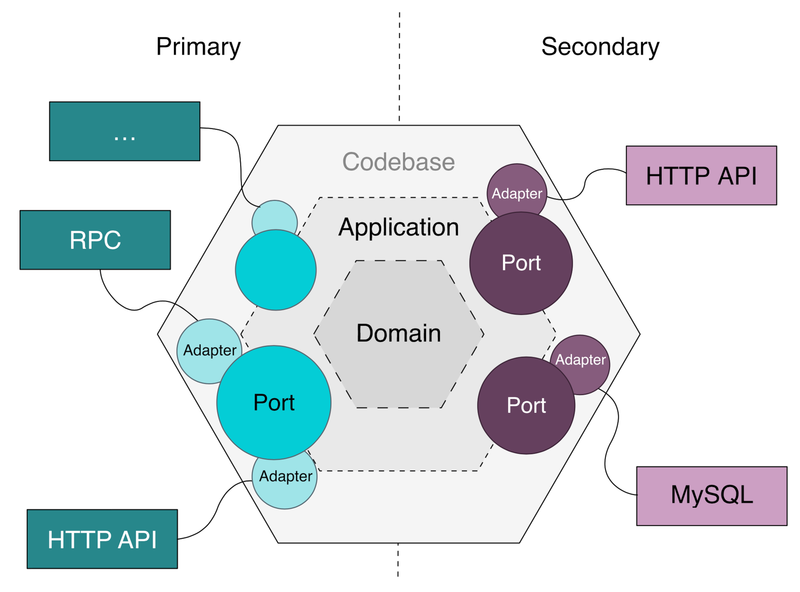

# Frontend Package Structure 
- TBD

# Backend Package Structure
- application
  - where ports are defined 
  - ports are used by the adapters(located in interfaces package)
- domain 
  - domain classes are defined
  - this is where the main business logic reside 
- infrastructure 
  - configuration, infrastructure classes are defined 
- interfaces
  - adapters(e.g. controllers) are defined 
  - adapters connect the outside world and ports  

# Links 
- [Swagger](http://localhost:8080/swagger-ui/index.html#/)

# Reference 
- https://engineering.linecorp.com/ko/blog/port-and-adapter-architecture

